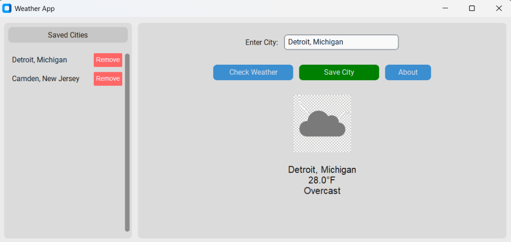
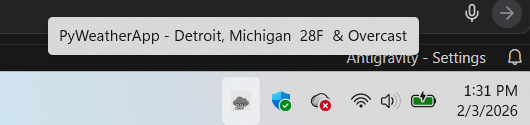

# Weather Application

A modern desktop weather assistant built with Python's `customtkinter` and valid requests to Open-Meteo. It features dynamic weather icons, system tray support, and a sidebar for managing saved cities.



_System Tray View:_

*The application minimizes to the system tray, showing the current temperature and providing detailed info on hover.*

## Features

- **Icon Visualization**: Displays custom weather icons (e.g., sunny, rainy, cloudy) based on real-time conditions.
- **System Tray Support**: Minimizes to the system tray with a dynamic icon showing the current temperature. Background processing ensures you stay updated without cluttering your taskbar.
- **City Management**:
  - **Sidebar List**: Save your favorite cities for quick access.
  - **Click-to-Load**: Instantly check the weather by clicking a saved city.
  - **Easy Removal**: Remove cities from your list with a single click.
- **Smart Geocoding**:
  - Supports "City, State" format (e.g., `Bayonne, NJ`) to distinguish between cities with the same name.
  - Automatically fetches coordinates and weather data.
- **Persistent Configuration**: Your saved cities and last selected location are stored in `config.json` and persist across restarts.

## Requirements

- **Python**: 3.9 or later
- **Dependencies** (install via `pip`):
  - `customtkinter`
  - `requests`
  - `pystray` (for system tray support)
  - `Pillow` (for image processing)

## Installation

1. **Clone the repository**:
   ```bash
   git clone https://github.com/mmastro333/PyWeatherApp.git
   cd PyWeatherApp
   ```

2. **Install dependencies**:
   ```bash
   pip install -r requirements.txt
   ```

## Usage

1. **Run the application**:
   ```bash
   python weather.py
   ```

2. **Check Weather**:
   - Type a city name (e.g., `London` or `Paris, TX`) in the input box.
   - Click **Check Weather**.

3. **Manage Cities**:
   - **Save**: After typing a city, click **Save City** to add it to the sidebar.
   - **Load**: Click any city name in the sidebar to view its weather.
   - **Remove**: Click the red **X** next to a city in the sidebar to delete it.

4. **Minimize to Tray**:
   - Close the window (click X) to minimize the app to the system tray.
   - The tray icon will display the current temperature.
   - **Right-click** the tray icon to **Open** the window or **Quit** the application.

## Project Structure

- `weather.py`: Main application logic (GUI, API calls, Tray).
- `weather_images/`: Directory containing dynamic weather icons.
- `config.json`: user preferences and saved cities (auto-generated).
- `requirements.txt`: Python dependencies.

## APIs Used

- **Open-Meteo**: Free weather API for geocoding and weather data. No API key required.

## Credits

This application was originally architected and hand-encoded by **Michael Mastrogiacomo**. It has since been expanded and "vibe coded" with the assistance of **Google's AntiGravity**, blending human engineering with advanced agentic AI capabilities.

